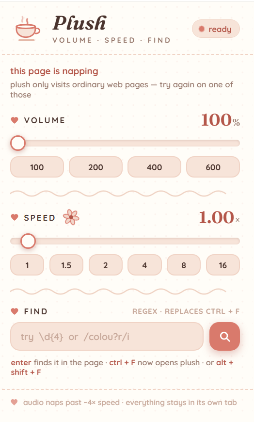

= plush

= Plush — Cozy Volume, Speed & Find
:toc: left
:toclevels: 3
:sectnums:
:sectanchors:
:experimental:
:source-highlighter: highlight.js
:revnumber: 1.0.0
:keywords: chrome-extension, volume-boost, playback-speed, regex-find

[.lead]
Plush is a small Chrome extension that does three unglamorous jobs with an
unreasonable amount of charm: it amplifies audio up to *600%*, locks video
playback anywhere from *0.25×* to *16.00×*, and replaces kbd:[Ctrl+F] with a
real regex-powered page search — all wrapped in cream paper, dusty rose, and
a teacup that steams faster as you crank the volume.

This document doubles as the user manual and the developer reference.

== Overview

* *Volume boost* — real amplification (a Web Audio `GainNode`), not the
  browser's volume slider. Applies to every `<video>` and `<audio>` element on
  an ordinary web page, including players added after page load and players
  tucked inside open shadow roots.
* *Playback speed* — sets `playbackRate` up to Chromium's absolute ceiling of
  16.00× and *keeps* it there, snapping it back whenever a site's player tries
  to reset it.
* *Regex find* — a floating search bar with full regular-expression support,
  live match counting, keyboard navigation, and non-destructive highlighting
  (the page's DOM is never modified).

Everything is *per-tab*: a 600% / 16× session never leaks into other tabs, and
navigating or reloading a tab resets it to calm defaults.

NOTE: Plush requests only the `storage` permission, collects nothing, and its
own code makes no network requests (see <<privacy>> for the one font exception).

[[requirements]]
== Requirements

Browser:: Any Chromium-based browser version 106 or newer — Chrome, Edge,
Brave, Opera, Vivaldi, Arc. Firefox and Safari are not supported (Manifest V3
service worker; Chromium audio behaviour).
Platform:: Windows, macOS, or Linux.
Privileges:: `storage` (remembers your last find pattern) and content-script
injection on `<all_urls>` (media discovery, find highlighting). Nothing else.
Disk:: Five small files. No build step, no bundler, no runtime dependencies
except two optional Google Fonts with graceful fallbacks.

[[install]]
== Installation

=== Load it unpacked

. Create a folder named `plush` containing the five files (<<file-layout>>).
. Open `chrome://extensions`.
. Toggle *Developer mode* (top right).
. Click *Load unpacked* and select the folder.
. Optional: pin Plush from the puzzle-piece menu so the teacup is always one
  click away.

=== Allow access to file URLs (optional)

Under `chrome://extensions` → *Plush* → *Details*, enable *Allow access to
file URLs* if you want boost, speed, and find to work on `file://` pages.

IMPORTANT: Content scripts are not injected into tabs that were *already open*
when the extension was installed or reloaded. Reload any tab you want Plush to
visit.

[[file-layout]]
=== File layout

----
plush/
├── manifest.json     Extension manifest (Manifest V3)
├── background.js     Service worker — badge painting, Alt+Shift+F relay
├── content.js        Per-tab engine — audio graph, speed lock, find bar
├── popup.html        Toolbar popup — the dressing-table card itself
└── popup.js          Popup logic — sliders, chips, pattern box
----

[[quickstart]]
== Quick start

. Open any page with a video.
. Click the Plush icon, drag *volume* to 600% and *speed* to 16.00.
. Press kbd:[Ctrl+F], type `\d{4}`, press kbd:[Enter] — you are now hopping
  between every four-digit number on the page.

[[tour]]
== A tour of the popup

Teacup:: The mascot. Its steam quickens as volume rises: one wisp every 3.6 s
at 100%, tightening to 1.1 s at 600%.
Status pill:: `ready` when the page's top frame answered Plush's handshake;
`napping` otherwise.
Volume:: Slider (100–600, step 5) plus quick chips (100 / 200 / 400 / 600).
Squiggle divider:: A hand-drawn wobble between sections. It does nothing. It
is essential.
Pressed flower:: Whirls at your chosen tempo — one turn per 11 ÷ speed
seconds, so 16× is a 0.7-second blur.
Speed:: Slider (0.25–16.00, step 0.05) plus chips (1 / 1.5 / 2 / 4 / 8 / 16).
Find:: A pattern box. Press kbd:[Enter] or the magnifier: the find bar opens
in the page and the popup closes itself.
Footer:: The small print — audio naps past ~4× speed; everything stays in its
own tab.

When the status pill says *napping*, the controls grey out and a small card
explains itself. See <<napping>>.

[[volume-feature]]
== Feature guide — volume boost

=== What "600%" means

100% is untouched audio. Above that, Plush routes each media element through a
Web Audio graph and multiplies sample amplitude — 600% is a gain of 6.0, a
genuine boost rather than nudging the element's `volume` property to its 1.0
maximum.

=== Using it

* Drag the slider or click a chip. The value pulses; the steam quickens.
* The toolbar badge shows the current state per tab — `600%` while boosting,
  `2.5×` when only speed is set. When both are active, the volume percentage
  wins the badge.

=== What it applies to

`<video>` and `<audio>` elements, discovered three ways: an initial scan at
page idle, a `MutationObserver` that picks up players added later (250 ms
debounce), and a 3-second sweep as a safety net. Discovery descends into open
shadow roots and runs in every frame, so embedded cross-origin players are
covered too.

TIP: Browsers suspend audio contexts until the user interacts with the page.
If boost seems inert right after load, click the page once — Plush listens for
gestures and resumes on its own.

CAUTION: 600% amplifies everything, including peaks the original mix never
expected. Distortion on hot signals is physics, not a bug — and mind your
ears and speakers.

[[speed-feature]]
== Feature guide — playback speed

=== Using it

Drag the slider (0.25–16.00) or click a chip. The flower keeps the tempo; the
badge shows the rate when boost is idle (e.g. `2.5×`).

=== The lock

Every discovered element gets a `ratechange` guard: the moment a site's player
moves the rate more than 0.01 away from your setting, Plush snaps it back.
Players discovered *later* inherit the current setting automatically. Clicking
the `1` chip releases the lock and explicitly restores every element to 1.00.

NOTE: 16.00× is a hard Chromium ceiling — no extension can exceed it.
NOTE: Chromium itself silences audio above roughly 4× playback speed. Boost
cannot recover what the browser refuses to mix. Use ≤4× when you want sound.

[[find-feature]]
== Feature guide — regex find

=== Opening the bar

[cols="2,3",options="header"]
|===
|Route |How

|In-page (default)
|kbd:[Ctrl+F] — kbd:[Cmd+F] on macOS. The native find bar is suppressed.

|Command (rebindable)
|kbd:[Alt+Shift+F]. Rebind at `chrome://extensions/shortcuts`.

|From the popup
|Type a pattern in the *find* box, press kbd:[Enter] or the magnifier.
|===

=== Reading the bar

A heart, an italic *plush find*, then four buttons: `Aa` (case toggle), prev,
next, close. Below, the input; below that, a status line that shows a hint
("type a pattern · enter jumps"), the live count ("3 / 87", or "3 / 2000+"
when truncated), or the regex engine's error message verbatim.

=== Two ways to write a pattern

Bare form:: The whole string is a regular expression, e.g. `\d{4}`. Matching
is case-sensitive by default; the `Aa` button switches to case-insensitive.
Literal form:: `/pattern/flags`, e.g. `/colou?r/i`, for explicit flags.

Supported flags:

[cols="1,3,4",options="header"]
|===
|Flag |Meaning |Notes

|`g`
|global
|Always forced on — Plush finds *all* matches.

|`i`
|ignore case
|Added and removed by the `Aa` toggle.

|`m`
|multiline
|`^` and `$` match line boundaries.

|`s`
|dotall
|`.` matches newlines.

|`u`
|unicode
|Full code-point matching.

|`v`
|unicode sets
|Modern set operations.

|`d`
|indices
|Accepted; harmless — the highlighter doesn't use indices.

|`y`
|sticky
|Stripped — sticky scanning would hide matches.
|===

=== Navigation

* kbd:[Enter] — next match. kbd:[Shift+Enter] — previous. Both wrap around.
* kbd:[Esc] or the close button dismisses the bar and clears highlights.
* The chosen match scrolls to about 38% from the top of the viewport.

=== What gets searched

All visible text nodes of the top frame, except inside `SCRIPT`, `STYLE`,
`NOSCRIPT`, `TEXTAREA`, `TEMPLATE`, `IFRAME`, `OBJECT`, `EMBED`, `SVG`,
`MATH`, `CANVAS`, `HEAD`, `TITLE`, `OPTION`, and `SELECT` — i.e. code,
invisible plumbing, and editable fields are skipped. Shadow DOM (open or
closed) and iframes are not searched; media control works in frames, find
does not.

=== Non-destructive highlighting

Highlights are absolutely-positioned rectangles in a dedicated overlay layer
pinned to *document coordinates*: they ride along when you scroll and never
enter the page's DOM, so React, Vue, and friends never notice. The overlay
re-measures itself when the DOM changes (~350 ms debounce) or the window
resizes (~200 ms).

=== Limits and timing

`MAX_MATCHES` of 2000 matched ranges and `MAX_RECTS` of 6000 painted
rectangles per scan (the count reads `2000+` when truncated). Typing re-runs
the search after 160 ms of quiet.

=== Pattern cookbook

`\d{4}`:: four-digit runs — years, ports, timestamps
`/colou?r/i`:: colour, color, COLOUR — the literal form, case-insensitive
`https?://\S+`:: URLs
`\b(TODO|FIXME)\b`:: work items (alternation)
`\b\d{1,3}(\.\d{1,3}){3}\b`:: IPv4 addresses
`[A-Z]{4,}`:: THINGS WRITTEN LIKE THIS

=== The last pattern is remembered

The pattern is saved to `chrome.storage.local` under the key `findPattern`
when the bar closes and when launched from the popup; the popup re-fills the
box next time. Local to your profile only.

[[shortcuts]]
== Keyboard shortcuts

[cols="2,2,4",options="header"]
|===
|Keys |Where |Action

|kbd:[Ctrl+F] / kbd:[Cmd+F]
|page (top frame)
|Open plush find; the native find bar is suppressed.

|kbd:[Alt+Shift+F]
|browser
|Open plush find. Rebindable at `chrome://extensions/shortcuts`.

|kbd:[Enter]
|find input
|Next match.

|kbd:[Shift+Enter]
|find input
|Previous match.

|kbd:[Esc]
|page
|Close the bar and clear highlights.
|===

[[scope]]
== Scope & lifecycle

* Settings are strictly per-tab. Navigation or reload resets them to 100% and
  1×, and the service worker clears the badge.
* `content.js` runs in *all frames*. Boost and speed are broadcast to every
  frame; the handshake and find go to the top frame only.
* The `ratechange` lock and the audio graph attach to elements as they appear,
  for as long as the tab lives.

[[napping]]
Pages where Plush cannot run — `chrome://` and `edge://` pages, the Chrome Web
Store, other extensions' pages, and the PDF viewer — show the *napping* card
in the popup instead of controls. This is a browser boundary, not a bug.

[[dev]]
== Developer reference

=== Architecture

----
┌────────────────┐  boost / speed (all frames)   ┌────────────────────┐
│ popup.html     │ ────────────────────────────▶ │   content.js       │
│ popup.js       │  hello / find (top frame)     │   every frame      │
└────────────────┘ ────────────────────────────▶ └─────────┬──────────┘
                                                           │ drives
                              ┌────────────────────────────┤
                              ▼                            ▼
                  <video>/<audio> + GainNode       regex find overlay
                                                   (top frame only)

┌─────────────┐  {type:'badge', text:'450%'}   ┌────────────────────┐
│ content.js  │ ─────────────────────────────▶ │  background.js     │
│ (top frame) │                                │  (service worker)  │
└─────────────┘                                └────────────────────┘
----

Three surfaces, cleanly separated: the popup never touches the page, the
content script never draws UI outside its own find bar, and the service
worker only paints badges and relays the `Alt+Shift+F` command.

=== Message protocol

[cols="1,2,2,4",options="header"]
|===
|`type` |From ▸ To |Payload |What happens

|`hello`
|popup ▸ top frame
|—
|Replies `{ok:true, boost, speed}` (boost as a whole-number percent). A reply
means the tab is alive; silence means *napping*.

|`boost`
|popup ▸ every frame
|`value` — percent, 100–600
|Clamped to a gain of 0–6, applied to all discovered media, badge updated.

|`speed`
|popup ▸ every frame
|`value` — rate, 0.25–16
|Clamped to 0.0625–16 and locked onto all discovered media. A value of `1`
releases the lock and resets elements.

|`find`
|popup ▸ top frame
|`pattern` — regex string
|Opens the find bar pre-filled; the popup closes itself.

|`badge`
|content ▸ service worker
|`text` — badge string
|Paints the toolbar badge (#C96F5E). Cleared by the worker on navigation.
|===

=== Media discovery

`findMedia()` walks a root, collecting `video`/`audio` elements and recursing
into open `shadowRoot`s. A `MutationObserver` re-scans added nodes on a 250 ms
debounce; a 3-second interval sweeps for anything missed. On first touch, each
element gets a `ratechange` guard installed.

=== The audio graph

Per element, one graph: `MediaElementSource → GainNode → destination`, cached
in a `WeakMap` as `{ctx, gain}` — or `{failed}` if construction threw, so
broken elements are skipped without retrying forever. Routing an element
through the source node is the whole mechanism: once connected, its audio
flows only through the graph, and `gain.value` is your multiplier. Suspended
contexts are resumed on the first gesture (`pointerdown`, `keydown`,
`touchstart`, capture, passive). EME-protected (DRM) sources throw on
`createMediaElementSource` and are permanently unboostable for that page load.

=== The speed lock

Applying speed writes `playbackRate` if it differs by more than 0.01; the
guard rewrites any later deviation. Releasing at `1` resets every discovered
element explicitly.

=== Find internals

Styles are installed via `CSSStyleSheet` + `adoptedStyleSheets` (immune to
page CSP) with a `<style>` fallback; the Google Fonts link is best-effort and
silently degrades to system fonts under strict CSP or offline. Scanning uses a
`TreeWalker` over text nodes with the skip-list from <<find-feature>>. Each
match becomes a `Range`; its `getClientRects()` become overlay divs positioned
at `clientRect + scroll offsets` inside a layer at `z-index: 2147483646`
(pointer-events: none, multiply blend), with the active match tinted and
ringed. Re-scans fire on the 160 ms input debounce, on foreign DOM mutations
(350 ms — mutations inside Plush's own layer or bar are ignored), and on
resize (200 ms). Regex input is normalized: the literal `/…/flags` form is
detected, flags are de-duplicated, `g` is forced, `y` is stripped.

=== Storage

[cols="2,2,4",options="header"]
|===
|Key |Type |Purpose

|`findPattern`
|string
|The last regex, written when the bar closes or the popup launches a search;
reloaded into the popup's pattern box.
|===

[[custom]]
== Customization

=== Recolor the card

Edit the `:root` variables in `popup.html`:

[cols="2,4",options="header"]
|===
|Variable |Role

|`--card`
|paper background

|`--blush`, `--blush2`
|tinted fills and borders

|`--rose`, `--rose-d`
|accents and deep accents

|`--cocoa`, `--cocoa2`, `--faint`
|text, muted text, faintest text
|===

The find bar's palette lives in the CSS string near the top of `find` in
`content.js`: `.plush-hl` (passive highlight, `rgba(222,124,105,.34)`) and
`.plush-hl-on` (active highlight, `rgba(236,183,94,.75)` plus the ring).

=== Give Ctrl+F back to Chrome

Delete this listener near the bottom of `content.js`; the popup and
kbd:[Alt+Shift+F] keep working:

[source,js]
----
/* Ctrl/Cmd + F belongs to Plush now — that was the promise */
document.addEventListener('keydown', e => {
  if (IS_TOP && (e.ctrlKey || e.metaKey) && !e.altKey && !e.shiftKey &&
      (e.key === 'f' || e.key === 'F')) {
    e.preventDefault();
    e.stopPropagation();
    find.open();
  }
}, true);
----

=== Make the Aa button mean "match case"

As shipped, matching is case-sensitive by default and the `Aa` toggle switches
to *ignore*-case. If you prefer the conventional mapping (lit = case
sensitive, insensitive default), change one ternary and one initializer:

[source,js]
----
// before (lit = ignore case)
let caseOn = false;
const fl = caseOn ? 'i' : '';

// after (lit = match case)
let caseOn = true;
const fl = caseOn ? '' : 'i';
----

=== Raise the ceilings

[source,js]
----
// content.js — allow up to 1000%
boost = Math.min(10, Math.max(0, (Number(msg.value) || 100) / 100));

// content.js — bigger find scans
const MAX_MATCHES = 2000, MAX_RECTS = 6000;   // raise freely; memory is the cost
----

Also set `max="1000"` on the volume slider in `popup.html`, and update the
track-fill math in `popup.js` from `(v - 100) / 5` to `(v - 100) / 9` for the
new 100–1000 span.

WARNING: Beyond ~800%, most material is indistinguishable from a hedge trimmer.
Clipping is guaranteed; treat anything past 600% as a curiosity.

=== Ideas for forks

* Persist boost/speed across navigation via `chrome.storage.session`.
* Per-site presets (YouTube always 2×, docs always muted).
* Iframe-aware find and a match-replace mode.
* A "midnight linen" dark theme.
* An options page with a pattern history.

[[limitations]]
== Limitations & known issues

DRM / EME media:: Netflix, Disney+, and friends cannot be boosted — the audio
graph cannot attach to protected streams. Speed usually still works.
Above ~4× speed:: Chromium mutes audio. A browser rule, not a setting.
16× ceiling:: Hard-coded in Chromium; unreachable for any extension.
Per-tab reset:: By design. Nothing persists across navigation.
Find and frames:: Matches inside iframes and shadow DOM are not found; the
bar itself exists only in the top frame.
Closed shadow roots:: Media inside them is invisible to any content script —
no boost, no speed.
Fixed-position text:: Highlights are document-coordinate. If fixed text moves
without a DOM mutation, its highlight can drift until the next re-scan;
editing the pattern forces one.
Fonts:: Offline or CSP-strict pages fall back to system stacks. Cosmetic only.

[[troubleshooting]]
== Troubleshooting

[cols="2,2,3",options="header"]
|===
|Symptom |Likely cause |Remedy

|Popup says *napping* on a normal page
|Tab predates install/update
|Reload the tab.

|Slider moves, no audible change
|DRM media, or context still suspended
|Click the page once. DRM streams cannot be boosted.

|Crackling at high boost
|Amplification clipping on a hot signal
|Expected. Lower the slider.

|Sound vanishes at 8×
|Chromium's ~4× audio cutoff
|Use ≤4× when you need to hear it.

|No effect on one specific site's player
|Player lives in a closed shadow root
|Not reachable by content scripts; nothing to do.

|kbd:[Ctrl+F] does nothing
|Napping page, or focus sits in an embedded viewer
|Try kbd:[Alt+Shift+F].

|Badge disappeared
|Tab navigated; badges clear on load
|Nudge a slider to re-set it.

|Typefaces look plain
|Fonts blocked or offline
|Cosmetic only; fallback stacks in use.
|===

[[faq]]
== FAQ

Does Plush change settings for the whole browser?:: No — strictly per tab.
Is anything sent to a server?:: No. The only stored data is your last find
pattern, in local extension storage.
Why did kbd:[Ctrl+F] stop opening Chrome's bar?:: By design. Restore it via
<<custom>> or disable the extension.
Can boost exceed 600%?:: The code clamps at 6.0; raising it is covered in
<<custom>>, with a warning you should read first.
Does speed work on YouTube? Netflix?:: Yes and usually yes — but never boost
on DRM sites.
Can it search *and* replace?:: Find only.
Where is my pattern stored?:: `chrome.storage.local`, key `findPattern`, on
your machine only.
Is there a mobile version?:: No — desktop Chromium only.

[[privacy]]
== Privacy

* Plush's own code makes no network requests and has no analytics.
* The single external fetch is a Google Fonts stylesheet for Fraunces and
  Quicksand, loaded by the popup and (best-effort) by the find bar. Offline or
  CSP-strict, it is skipped and system fonts are used. Privacy maximalists can
  delete the two font links without losing any functionality.
* Page content is read only to locate media elements and find matches. Nothing
  is logged, transmitted, or stored beyond the `findPattern` key.

[[uninstall]]
== Uninstalling

`chrome://extensions` → Plush → *Remove*. The one stored find pattern is
deleted with it. Any tab left at 600% / 16× resets on its next navigation.

[[appendix-manifest]]
== Appendix A: The manifest

[source,json]
----
{
  "manifest_version": 3,
  "name": "Plush — cozy volume, speed & find",
  "version": "1.0.0",
  "description": "A warm little toolkit: 600% volume boost, 16.00× playback on any video, and regex-powered page find.",
  "minimum_chrome_version": "106",
  "permissions": ["storage"],
  "background": { "service_worker": "background.js" },
  "action": { "default_popup": "popup.html", "default_title": "Plush" },
  "commands": {
    "open-find": {
      "suggested_key": { "default": "Alt+Shift+F" },
      "description": "Open the Plush find bar"
    }
  },
  "content_scripts": [
    {
      "matches": ["<all_urls>"],
      "js": ["content.js"],
      "run_at": "document_idle",
      "all_frames": true
    }
  ]
}
----

[cols="2,4",options="header"]
|===
|Key |Why it is what it is

|`minimum_chrome_version: 106`
|Declared floor for the APIs the find bar relies on.

|`permissions: ["storage"]`
|The only permission — remembers the last find pattern.

|`all_frames: true`
|So embedded players in iframes are discovered and controlled.

|`run_at: document_idle`
|Media scan runs after the page has settled.

|`commands.open-find`
|Backs kbd:[Alt+Shift+F]; rebindable by the user.
|===

[[appendix-constants]]
== Appendix B: Knobs & constants

[cols="2,2,2,4",options="header"]
|===
|Constant |File |Default |Meaning

|`MAX_MATCHES`
|content.js
|2000
|Upper bound on matched ranges per scan.

|`MAX_RECTS`
|content.js
|6000
|Upper bound on painted highlight rectangles.

|input debounce
|content.js
|160 ms
|Quiet period after typing before a re-scan.

|reflow debounce
|content.js
|350 ms
|Re-scan delay after foreign DOM mutations.

|resize debounce
|content.js
|200 ms
|Re-measure delay on window resize.

|mutation debounce
|content.js
|250 ms
|Media re-discovery delay after nodes are added.

|sweep interval
|content.js
|3000 ms
|Safety-net scan for media the observer missed.

|boost clamp
|content.js
|0–6
|Gain ceiling (6 = 600%).

|speed clamp
|content.js
|0.0625–16
|Rate bounds accepted from messages.

|badge colour
|background.js
|#C96F5E
|Dusty-rose badge background.

|scroll anchor
|content.js
|38%
|Where the chosen match lands, vertically.

|steam period
|popup.html
|3.6 → 1.1 s
|Teacup animation follows the volume slider.

|flower period
|popup.html
|11 ÷ speed s
|Bloom's spin follows the speed slider.
|===

[[changelog]]
== Appendix C: Release notes

1.0.0:: First public teacup. 600% Web Audio boost with per-element graphs and
failure marking; 16.00× speed lock with `ratechange` guard; regex find with
overlay highlighting, case toggle, literal flag form, truncation counting,
reflow re-measurement, `Ctrl+F` / `Alt+Shift+F` entry, and `findPattern`
persistence.
